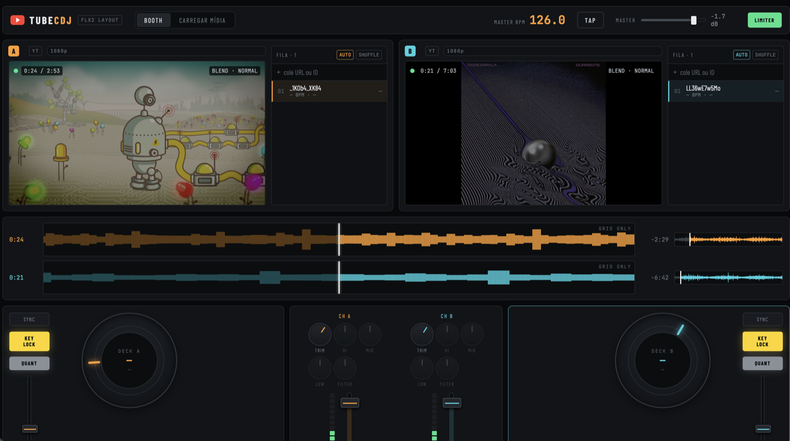

# TubeCDJ

Dois decks de YouTube mixáveis, com o layout de controles de uma Pioneer DDJ-FLX2.
100% client-side: vanilla JS (ES modules) + Vite, Web Audio, `localStorage`. Sem backend, sem chave de API, sem dependência em runtime.

O que o navegador permite fazer com áudio do YouTube é limitado, e a interface diz isso na cara em vez de fingir — veja [O que é real e o que não é](#o-que-é-real-e-o-que-não-é).

**No ar:** <https://dobidu.github.io/tubecdj/>



## Rodar

```bash
npm install
npm run dev      # http://localhost:5173
npm run build    # dist/
npm run preview  # serve o build em http://localhost:4173
```

O IFrame Player API exige uma origem HTTP — abrir `index.html` via `file://` não funciona.

## Deploy

Hospedado no GitHub Pages, publicado a partir da branch `gh-pages`:

```bash
npm run deploy   # build com BASE_PATH=/tubecdj/ e push para gh-pages
```

`BASE_PATH` existe porque um *project site* do GitHub é servido em `/<repo>/`, não na raiz do domínio. Em qualquer host que sirva na raiz (Cloudflare Pages, Netlify, Vercel), basta `npm run build`.

### Automatizar com Actions (opcional)

O deploy acima é manual por um motivo bobo: o GitHub recusa push em `.github/workflows/` vindo de um token OAuth sem o escopo `workflow`. O workflow pronto está guardado em [`docs/github-pages-workflow.yml`](docs/github-pages-workflow.yml). Para ativá-lo:

```bash
gh auth refresh -s workflow
mkdir -p .github/workflows
git mv docs/github-pages-workflow.yml .github/workflows/deploy.yml
git commit -m "ci: deploy to GitHub Pages" && git push
gh api repos/dobidu/tubecdj/pages -X PUT --input - <<< '{"build_type":"workflow"}'
```

A partir daí, todo push em `main` republica sozinho — Actions é gratuito e sem limite de minutos em repositórios públicos.

## O que é real e o que não é

**Modo YT (padrão)** — o IFrame Player API não expõe o buffer de áudio, então:

| Real | Inerte (sinalizado na UI com opacidade + tooltip) |
|---|---|
| play/pause, cue, hot cues e beat loop — **com ~2 s de imprecisão** | EQ 3 bandas (HI/MID/LOW) |
| volume composto: TRIM × channel fader × crossfader × master → `setVolume` | filtro bipolar |
| velocidade em degraus de **5%** via `setPlaybackRate` | pitch fino (±8%) e, com ele, beatmatching |
| — | SYNC por razão de BPM |
| crossfade de vídeo (`opacity`, com piso de 22%) + `mix-blend-mode` no deck B | — |

KEY LOCK fica travado em ON no Modo YT: o YouTube já preserva o pitch percebido ao mudar a velocidade.
O VU, no Modo YT, é estimado a partir do ganho calculado (não há PCM para medir).

`seekTo` encosta no keyframe mais próximo — a documentação admite *"usually no more than around two seconds"* antes do alvo. Então cue e loop no Modo YT são regiões, não pontos, e QUANT tem pouco a fazer. Os tooltips dizem isso em cada controle.

### Antes do primeiro play, o deck é nosso

O iframe do YouTube **só é criado quando você manda tocar**. Até lá o deck mostra a capa do próprio vídeo com um botão de play. Isso evita o estado *cued* cheio de marca do YouTube de forma legítima — cobrir um player existente é proibido, não ter criado nenhum ainda não é — e mantém 1,6 MB de player fora do carregamento inicial.

Depois do primeiro play, o chrome do estado pausado aparece e não há o que fazer.

### O teto de 5% — e por que beatmatching não existe no Modo YT

A documentação da IFrame API diz que um rate não suportado é arredondado para o valor mais próximo de `getAvailablePlaybackRates()`. **O player não faz isso.** No código do próprio player, esse array é usado só para o primeiro e o último elemento, como limites, e qualquer múltiplo de **0.05** entre eles é aceito:

```
pedido 1.037 → 1.00      pedido 1.08 → 1.05      pedido 1.333 → 1.30
pedido 0.96  → 0.95      pedido 0.92 → 0.90      pedido 99    → 2.00
```

Ou seja: existe controle de velocidade, mas em degraus de 5%. Numa faixa de 128 BPM os vizinhos são 121,6 e 134,4 BPM — inútil para casar batida. Por isso o fader de pitch e o SYNC aparecem inertes no Modo YT, mostrando a velocidade realmente aplicada (`1.05×`) em vez de uma porcentagem que o player ignora. **Beatmatching de verdade só em Local Audio Mode.**

**Local Audio Mode (por deck)** — arraste um MP3/WAV/M4A/FLAC/OGG sobre o player do deck. O vídeo continua como imagem (mudo) e o áudio local passa pelo grafo completo:

```
source → trim → highshelf 3.2k / peaking 1k Q1 / lowshelf 250 (±26 dB)
       → filtro bipolar (LP 20k→200 Hz | HP 20→2000 Hz, bypass em 0.5)
       → fxSend (paralelo) → channel fader → xfader
       → master → DynamicsCompressor (limiter) → destination
```

Aqui EQ, filtro, FX, waveform real (picos RMS), BPM automático (autocorrelação de onset na banda 60–200 Hz, 70–180 BPM) e **detecção de key** funcionam. Todas as mudanças de ganho usam `setTargetAtTime` — sem cliques.

A análise (BPM + key) é guardada por arquivo (`nome:tamanho`), então soltar a mesma faixa de novo é instantâneo.

## Key e mistura harmônica

Só no Local Audio Mode — o YouTube não entrega PCM, então deck em Modo YT fica sem key, e isso aparece como ausência de badge, não como valor falso.

- Cromagrama por filtros de Goertzel, um por semitom de C2 a C6 (mais barato e mais seletivo que uma FFT cheia para 49 bins), com oitavas graves pesando mais que as agudas.
- Perfis de Krumhansl-Schmuckler correlacionados nas 24 rotações; correlação abaixo de 0.35 vira "não sei" em vez de um chute.
- Resultado em notação **Camelot** (`8A`, `5B`…) mais o nome da nota, no badge do deck e no hub do jog.
- O badge fica verde quando a key do deck combina com a do outro pelas regras clássicas: mesma key, relativa (mesmo número, letra trocada) ou um passo na roda. O tooltip diz qual é a relação.

Verificado com sinal sintético (tríades em 6 keys): 6/6, confiança 0.84–0.91. Material real com bateria e vocal é mais difícil que isso — trate como sugestão, não como verdade.

## Preferências

Na aba **Carregar mídia**, persistidas em `tubecdj:prefs`:

| Preferência | Efeito |
|---|---|
| Piso do vídeo | 0–60%; opacidade que o deck mantém com o crossfader todo no outro lado (padrão 22%) |
| Faixa do pitch | ±8% ou ±16% como padrão dos dois decks |
| Rampa do corte SHARP | 0/10/20/50 ms; suaviza o corte da curva SHARP. Só em Local Audio Mode |

**AUTO** no cabeçalho de cada fila liga/desliga o auto-avanço daquele deck (por deck, persistido). Desligado, a faixa acaba e o deck pausa.

## Carregar mídia

O caminho rápido não sai do booth — cada fila tem um campo de URL no próprio cabeçalho:

| Gesto | Resultado |
|---|---|
| URL no campo da fila + `Enter` | enfileira naquele deck; carrega direto se ele estiver vazio ou parado |
| `Shift+Enter` | carrega agora, mesmo tocando |
| `⌘V` / `Ctrl+V` no booth | mesma coisa, no deck focado, sem clicar |
| arrastar link do navegador para a **fila** | enfileira |
| arrastar link para o **player** | carrega agora |
| arrastar MP3/WAV para o player | Local Audio Mode (analisa BPM + key) |
| arrastar arquivo de áudio para um pad do sampler | substitui aquele slot |
| clique numa linha da fila | carrega aquela faixa |

**Deck tocando nunca é cortado por acidente**: o padrão é enfileirar. Só carrega sozinho quando o deck está vazio ou parado.

A aba **Carregar mídia** existe para o trabalho em lote: abrir uma playlist inteira (`?list=`, até 50 faixas) e voltar em algo recente. A leitura da playlist usa um player oculto, então nenhum deck é interrompido para expandir a lista.

- Aceita URL de vídeo (`watch?v=`, `youtu.be`, `/shorts/`, `/embed/`), ID de 11 caracteres e URL de playlist (`?list=`).
- `getPlaylist()` devolve no máximo **200** vídeos, independente do tamanho real da playlist.
- Os IDs da playlist vêm do próprio player (`getPlaylist()`).
- **Títulos**: o player informa o título da faixa carregada assim que ela é cued — sem rede, sem terceiros. Para os itens ainda na fila, o título vem do oEmbed público (`noembed.com`), já que o oEmbed oficial do YouTube responde sem `Access-Control-Allow-Origin` e é inutilizável do browser. Se um bloqueador de conteúdo comer o noembed, a fila mostra o ID cru até a faixa ser carregada, e aí o nome real aparece.
- **Sem busca por título**: exigiria a YouTube Data API v3 com chave de servidor, o que não roda só no cliente.
- Fila por deck: até 50 faixas, arrasto reordena, botão direito remove, SHUFFLE embaralha, auto-avanço opcional por deck (chip AUTO; respeita loop ativo).

## Atalhos

`Q`/`P` play A/B · `W`/`O` cue · `Espaço` play do deck focado · `1–4` hot cues (Shift apaga) · `←`/`→` crossfader · `↑`/`↓` channel fader do deck focado · `L` loop · `F` FX on · `Tab` alterna o foco (borda na cor do deck).

`Tab` só troca o deck focado enquanto nada está focado; depois que você entra no console pelo teclado, `Tab` volta a ser navegação normal.

## Acessibilidade e polish

- Todo controle discreto é `<button>` real com `aria-pressed`; knobs, faders, pitch e crossfader são `role="slider"` com `aria-valuenow`/`aria-valuetext`, operáveis por setas (`PageUp/Down` salta, `Home/End` vai aos extremos, `Enter` recentra).
- Foco visível na cor do deck em todo controle; nenhum outline removido sem substituto.
- Transições de 140–200 ms com easing de desaceleração só em cor/borda/sombra/transform — nada de animar layout. `prefers-reduced-motion` zera transições e congela a rotação do jog.
- Deck vazio não desenha waveform falsa: só a linha de base, sem rótulo.
- Buffering aparece no dot do OSD (âmbar pulsando) — antes só havia tocando/parado.
- Números que se leem no meio da mixagem (tempo restante, duração e BPM da fila) usam `--text-4`; os labels decorativos de 9px seguem em `--text-5`, abaixo de AA — decisão de fidelidade ao hardware, registrada em `.impeccable.md`.
- Desktop-only por desenho (mínimo 1320px): não há layout mobile nem alvos de toque de 44px. Uma barra de load global custaria ~46px de altura e estouraria o orçamento vertical de 1600×1000 — por isso a entrada de URL vive no cabeçalho da fila.

Contexto de design (público, tom, barra de qualidade) em `.impeccable.md`.

## Vídeo

O crossfader controla a opacidade dos dois players além do volume. O deck que sai **não apaga por completo**: fica em 22% (`MIN_VIDEO_OPACITY` em `src/video/blend.js`), o suficiente para ver que a faixa continua rodando e onde ela está antes de trazê-la de volta. O corte de áudio continua indo a zero — o piso é só visual. O OSD (dot de estado e tempo) fica sempre em opacidade cheia, fora do crossfade.

`VIDEO BLEND` aplica `mix-blend-mode` no player do deck B: NORMAL, ADD (`screen`), DIFF (`difference`), LUMA (`luminosity`).

## Persistência

Chaves com prefixo `tubecdj:` — `mixer`, `deck:A`, `deck:B`, `cues:<videoId>`, `bpm:<videoId>`, `an:local:<arquivo>` (BPM+key analisados), `prefs`, `history`. Samples do usuário ficam no IndexedDB `tubecdj`. Filas, hot cues, posições de knobs/faders, curva, blend e a posição de reprodução voltam no reload (os decks retornam pausados).

## Estrutura

```
index.html
.impeccable.md       contexto de design (público, tom, barra de qualidade)
src/
  main.js            bootstrap, ações, loop de transporte, atalhos, player oculto de playlist
  state.js           store único + subscribe + persistência
  util.js            drag com pointer capture, formatação, PRNG
  yt/player.js       wrapper do IFrame API por deck
  yt/queue.js        parse de URL, fila, oEmbed
  audio/graph.js     MasterBus, ChannelStrip, LocalTrack
  audio/fx.js        echo, reverb (IR gerada), flanger, filtro varrido
  audio/analyser.js  decode, picos RMS, detecção de BPM
  audio/sampler.js   4 one-shots sintetizados + slots do usuário
  audio/sampleStore.js  samples do usuário em IndexedDB
  audio/key.js       cromagrama (Goertzel) + Krumhansl-Schmuckler
  mix/crossfader.js  curvas SMOOTH/MID/SHARP + ganho composto
  mix/sync.js        pitch, rate, BPM efetivo, quantize
  mix/harmony.js     roda Camelot e compatibilidade harmônica
  ui/*.js            knob, fader, jog, pads, waveform (canvas), fila (com entrada de URL), deck, mixer, topbar, load
  video/blend.js     opacidade + mix-blend-mode
  styles.css         tokens do protótipo
```

## Sampler

Os 4 pads vêm com one-shots sintetizados (air horn, vinyl brake, siren, clap — sem assets no repositório). Arraste um arquivo de áudio sobre um pad para substituir aquele slot: ele é guardado em **IndexedDB** e volta no reload. Shift+clique ou botão direito devolve o som padrão.

## Limitações conhecidas

- Local Audio Mode não faz time-stretch: com key lock "off" o pitch acompanha a velocidade (o Web Audio nativo não tem stretch).
- O vídeo do YouTube pode derivar alguns quadros em relação ao áudio local depois de muitos scratches — ele é imagem, não referência de tempo.
- Key só no Local Audio Mode, e só como sugestão: material real com bateria pesada confunde o cromagrama mais que as tríades sintéticas do teste.
- Vídeos com embed bloqueado pelo dono não tocam — o deck reporta o erro do player.
- Desktop-only por desenho: mínimo de 1320px, sem layout mobile.
- **iOS/Safari**: o WebKit impõe uma única reprodução audível por vez entre iframes, então tocar dois decks ao mesmo tempo provavelmente não funciona lá. Não testado em hardware.
- O estado pausado do player mostra a marca do YouTube (título, avatar do canal, "Assista no YouTube"). Isso **não** é removível: `modestbranding` foi descontinuado em 2023 e cobrir o player é proibido pelos termos.
- Requer um navegador moderno com Web Audio, `OfflineAudioContext`, IndexedDB e `color-mix()` em CSS (Chrome/Edge 111+, Firefox 113+, Safari 16.4+).

## Uso e YouTube

A reprodução usa a **IFrame Player API** oficial: os vídeos tocam no player do YouTube, com a marca, os anúncios e a contagem de views que o dono da mídia espera. Nada é baixado, extraído ou recodificado — por isso EQ e FX não alcançam o áudio do YouTube.

Três decisões de produto vêm diretamente da [Required Minimum Functionality](https://developers.google.com/youtube/terms/required-minimum-functionality) e das [Developer Policies](https://developers.google.com/youtube/terms/developer-policies):

- **Nada é desenhado por cima do player.** A RMF proíbe overlays na frente de qualquer parte do player, sem exceção para o estado pausado. Por isso o chrome do YouTube aparece quando um deck está parado, e os indicadores de estado ficam no cabeçalho do deck, fora da área de vídeo.
- **O iframe continua clicável.** Bloquear os controles do player cai em "block any portion or functionality of a YouTube player".
- **O auto-avanço nunca inicia dois decks ao mesmo tempo.** Um `playVideo()` por script conta como reprodução automática, e a RMF proíbe mais de um player em reprodução automática simultânea. Se o outro deck estiver tocando, a próxima faixa é carregada e fica em espera.

Ainda assim: dois players audíveis ao mesmo tempo, iniciados por você, é o caso de uso central e não é coberto por essas cláusulas — mas leia os termos você mesmo antes de usar isto para qualquer coisa além de uso pessoal.

Você é responsável pelo que toca. Apresentação pública de música gravada costuma exigir licenciamento próprio, independentemente da ferramenta.

## Licença

MIT — veja [LICENSE](LICENSE).
